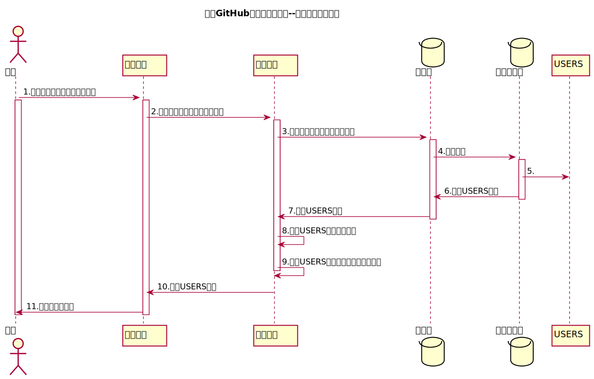

<!-- markdownlint-disable MD033-->
<!-- 禁止MD033类型的警告 https://www.npmjs.com/package/markdownlint -->

# “登录”用例 [返回](../README.md)

## 1. 用例规约

<table border=0 cellpadding=0 cellspacing=0 width=373 style='border-collapse:
 collapse;table-layout:fixed;width:279pt'>
 <col width=66 style='mso-width-source:userset;mso-width-alt:2332;width:49pt'>
 <col width=67 style='mso-width-source:userset;mso-width-alt:2389;width:50pt'>
 <col width=90 style='mso-width-source:userset;mso-width-alt:3214;width:68pt'>
 <col width=150 style='mso-width-source:userset;mso-width-alt:5319;width:112pt'>
 <tr height=18 style='height:13.8pt'>
  <td height=18 class=xl1526300 width=66 style='height:13.8pt;width:49pt'>用例编号</td>
  <td class=xl1526300 align=right width=67 style='width:50pt'>1</td>
  <td class=xl1526300 width=90 style='width:68pt'>名称</td>
  <td class=xl1526300 width=150 style='width:112pt'>登陆</td>
 </tr>
 <tr height=18 style='height:13.8pt'>
  <td height=18 class=xl1526300 style='height:13.8pt'>创建日期</td>
  <td class=xl1526300>2020.5.10</td>
  <td class=xl1526300>最后更新日期</td>
  <td class=xl1526300>2020.5.15</td>
 </tr>
 <tr height=18 style='height:13.8pt'>
  <td height=18 class=xl1526300 style='height:13.8pt'>参与者</td>
  <td colspan=3 class=xl1526300>学生、老师</td>
 </tr>
 <tr height=42 style='mso-height-source:userset;height:31.2pt'>
  <td height=42 class=xl1526300 style='height:31.2pt'>前置条件</td>
  <td colspan=3 class=xl6326300 width=307 style='width:230pt'>登陆者为该系统用户，已有相应的用户号和密码</td>
 </tr>
 <tr height=18 style='height:13.8pt'>
  <td height=18 class=xl1526300 style='height:13.8pt'>后置条件</td>
  <td colspan=3 class=xl1526300>登陆后课进行相应功能的操作</td>
 </tr>
 <tr height=18 style='height:13.8pt'>
  <td height=18 class=xl1526300 style='height:13.8pt'>流程</td>
  <td colspan=3 class=xl1526300>1.用户进入系统的登陆界面&lt;/br&gt;
  2.输入用户名（学号或工号）&lt;/br&gt; 3.输入密码 4.选择身份，点击登录&lt;/br&gt; 5.成功登录系统</td>
 </tr>
 <tr height=18 style='height:13.8pt'>
  <td height=18 class=xl1526300 style='height:13.8pt'>拓展流程</td>
  <td colspan=3 class=xl6326300 width=307 style='width:230pt'>1.用户的登陆名在数据库中未找到，显示“用户名不存在的信息”&lt;/br&gt;
  2.输入的密码和数据库中的密码不一致，显示“密码错误信息”</td>
 </tr>
 <![if supportMisalignedColumns]>
 <tr height=0 style='display:none'>
  <td width=66 style='width:49pt'></td>
  <td width=67 style='width:50pt'></td>
  <td width=90 style='width:68pt'></td>
  <td width=150 style='width:112pt'></td>
 </tr>
 <![endif]>
</table>

## 2. 业务流程[源码](../src/登录时序图.puml)

## 3. 界面设计
- 界面参照: https://yangyam.github.io/is_analysis/test6/ui/login.html
- API接口调用
    - 接口1：[login](../接口/login.md)

## 4. 算法描述 
无
    
## 5. 参照表

- [USERS](../Database.md/#USERS)
