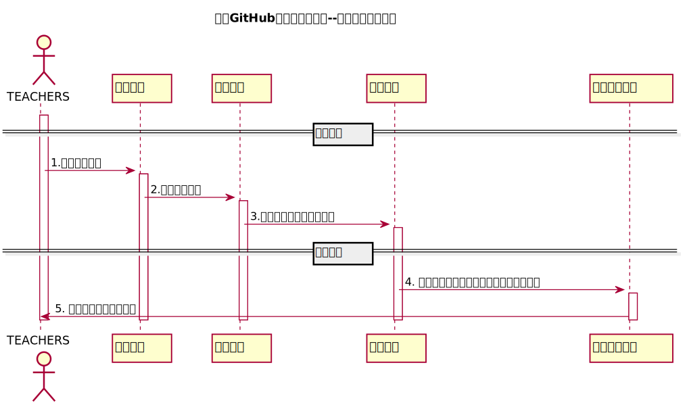

<!-- markdownlint-disable MD033-->
<!-- 禁止MD033类型的警告 https://www.npmjs.com/package/markdownlint -->

# “评定成绩”用例 [返回](../README.md)
## 1. 用例规约
<table border=0 cellpadding=0 cellspacing=0 width=320 style='border-collapse:
 collapse;table-layout:fixed;width:240pt'>
 <col width=64 span=5 style='width:48pt'>
 <tr height=18 style='height:13.8pt'>
  <td height=18 width=64 style='height:13.8pt;width:48pt'>用例编号</td>
  <td align=right width=64 style='width:48pt'>8</td>
  <td width=64 style='width:48pt'>名称</td>
  <td colspan=2 width=128 style='mso-ignore:colspan;width:96pt'>名称：	修改实验</td>
 </tr>
 <tr height=18 style='height:13.8pt'>
  <td height=18 style='height:13.8pt'>创建日期</td>
  <td>2020.5.10</td>
  <td>最后更新日期</td>
  <td>2020.5.15</td>
  <td></td>
 </tr>
 <tr height=18 style='height:13.8pt'>
  <td height=18 style='height:13.8pt'>参与者</td>
  <td colspan=3>老师</td>
  <td></td>
 </tr>
 <tr height=18 style='height:13.8pt'>
  <td height=18 style='height:13.8pt'>前置条件</td>
  <td colspan=3 class=xl65 width=192 style='width:144pt'>登陆者为该老师，已经有相应密码，进入主界面后选择某一科目下的某一实验。</td>
  <td></td>
 </tr>
 <tr height=18 style='height:13.8pt'>
  <td height=18 style='height:13.8pt'>后置条件</td>
  <td colspan=3>完成实验修改操作</td>
  <td></td>
 </tr>
 <tr height=18 style='height:13.8pt'>
  <td height=18 style='height:13.8pt'>流程</td>
  <td colspan=3 class=xl65 width=192 style='width:144pt'>1老师进入系统的登陆界面。 
    2选择教师登陆 
    3输入相应的密码，点击登陆按钮。 
    4成功登陆系统，显示登陆成功。 
    5在课程列表选择实验。6.点击修改&nbsp; 7.编辑实验信息</td>
  <td></td>
 </tr>
 <tr height=18 style='height:13.8pt'>
  <td height=18 style='height:13.8pt'>拓展流程</td>
  <td colspan=3 class=xl65 width=192 style='width:144pt'>无</td>
  <td></td>
 </tr>
 <![if supportMisalignedColumns]>
 <tr height=0 style='display:none'>
  <td width=64 style='width:48pt'></td>
  <td width=64 style='width:48pt'></td>
  <td width=64 style='width:48pt'></td>
  <td width=64 style='width:48pt'></td>
  <td width=64 style='width:48pt'></td>
 </tr>
 <![endif]>
</table>

## 2. 业务流程（顺序图） [源码](../src/评分时序图.puml)
 

    
## 3. 界面设计
- 界面参照: https://yangyam.github.io/is_analysis_test6/ui/evaluate_grades.html

- API接口调用

    - 接口1：[getNextPrevStudent](../接口/getNextPrevStudent.md)
        
        用于取得上一个或者下一个学生的学号
        
    - 接口2：[getOneStudentScore](../接口/getOneStudentScore.md)
        
        用于显示一个学生的所有实验成绩和评语
         
    - 接口3：[setOneStudentResults](../接口/setOneStudentResults.md)
    
        用于设置一个学生的部分实验成绩和评语
    
    
## 4. 算法描述
    无
    
## 5. 参照表

- [STUDENTS](../DataBase.md/#STUDENTS)
- [GRADES](../DataBase.md/#GRADES)
- [EXAMINATION](../DataBase.md/#EXAMINATION)
- [COURSE](../DataBase.md/#COURSE)

