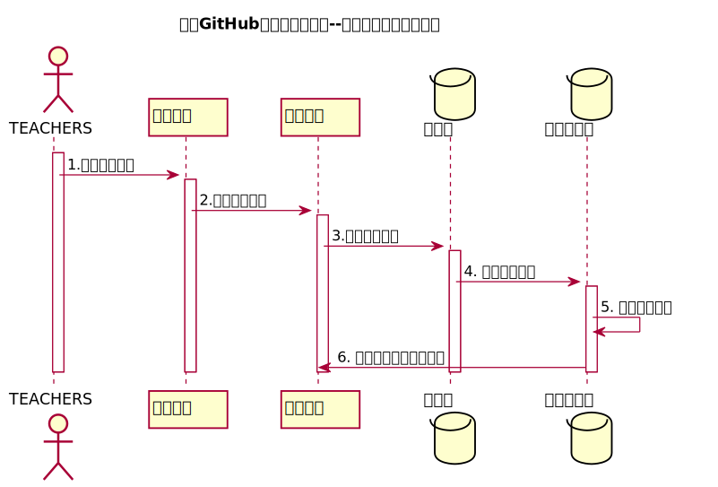

<!-- markdownlint-disable MD033-->
<!-- 禁止MD033类型的警告 https://www.npmjs.com/package/markdownlint -->

# “评分标准设置”用例 [返回](../README.md)
## 1. 用例规约

<table border=0 cellpadding=0 cellspacing=0 width=320 style='border-collapse:
 collapse;table-layout:fixed;width:240pt'>
 <col width=64 span=5 style='width:48pt'>
 <tr height=18 style='height:13.8pt'>
  <td height=18 class=xl1515382 width=64 style='height:13.8pt;width:48pt'>用例编号</td>
  <td class=xl1515382 align=right width=64 style='width:48pt'>14</td>
  <td class=xl1515382 width=64 style='width:48pt'>名称</td>
  <td class=xl1515382 colspan=2 width=128 style='width:96pt'>设置评分规则</td>
 </tr>
 <tr height=18 style='height:13.8pt'>
  <td height=18 class=xl1515382 style='height:13.8pt'>创建日期</td>
  <td class=xl1515382>2020.5.10</td>
  <td class=xl1515382>最后更新日期</td>
  <td class=xl1515382>2020.5.15</td>
  <td class=xl1515382></td>
 </tr>
 <tr height=18 style='height:13.8pt'>
  <td height=18 class=xl1515382 style='height:13.8pt'>参与者</td>
  <td colspan=3 class=xl1515382>老师</td>
  <td class=xl1515382></td>
 </tr>
 <tr height=18 style='height:13.8pt'>
  <td height=18 class=xl1515382 style='height:13.8pt'>前置条件</td>
  <td colspan=3 class=xl6515382 width=192 style='width:144pt'>1教师已经成功登录到系统，进入主界面&lt;br&gt; 
    2用户需要进入自己教学的某一课程</td>
  <td class=xl1515382></td>
 </tr>
 <tr height=18 style='height:13.8pt'>
  <td height=18 class=xl1515382 style='height:13.8pt'>后置条件</td>
  <td colspan=3 class=xl1515382>用户设置评分成功。</td>
  <td class=xl1515382></td>
 </tr>
 <tr height=18 style='height:13.8pt'>
  <td height=18 class=xl1515382 style='height:13.8pt'>流程</td>
  <td colspan=3 class=xl6515382 width=192 style='width:144pt'>1用户进入系统的登陆界面。&lt;br&gt; 
   
  2输入正确的用户名和密码，并且成功进入系统。&lt;br&gt;3在主界面上了选择教学列表的某一课程。&lt;br&gt;4.进入课程,点击设置评分细则。&lt;br&gt;5.填入评分和占比，提交。</td>
  <td class=xl1515382></td>
 </tr>
 <tr height=18 style='height:13.8pt'>
  <td height=18 class=xl1515382 style='height:13.8pt'>拓展流程</td>
  <td colspan=3 class=xl6515382 width=192 style='width:144pt'>无</td>
  <td class=xl1515382></td>
 </tr>
 <![if supportMisalignedColumns]>
 <tr height=0 style='display:none'>
  <td width=64 style='width:48pt'></td>
  <td width=64 style='width:48pt'></td>
  <td width=64 style='width:48pt'></td>
  <td width=64 style='width:48pt'></td>
  <td width=64 style='width:48pt'></td>
 </tr>
 <![endif]>
</table>

## 2. 业务流程（顺序图） [源码](../src/评分标准设定.puml)
 

    
## 3. 界面设计
- 界面参照: https://yangyam.github.io/is_analysis_test6/ui/evaluate_principle.html

- API接口调用

    - 接口1：[setProgram_rate](../接口/setProgram_rate.md)
        
        用于设置相应实验的评分标准以及占比
        
    
## 4. 算法描述
    无
    
## 5. 参照表

- [COURSE](../DataBase.md/#COURSE)
- [SCORES](../DataBase.md/#SCORES)
- [EXAMINATION](../DataBase.md/#EXAMINATION)

