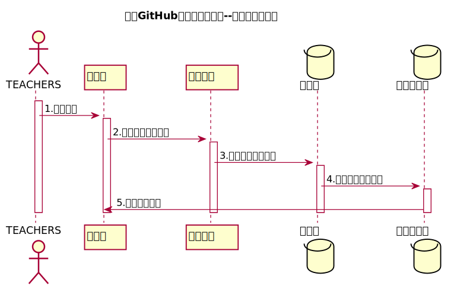

<!-- markdownlint-disable MD033-->
<!-- 禁止MD033类型的警告 https://www.npmjs.com/package/markdownlint -->

# “学生列表”用例 [返回](../README.md)
## 1. 用例规约

<table border=0 cellpadding=0 cellspacing=0 width=320 style='border-collapse:
 collapse;table-layout:fixed;width:240pt'>
 <col width=64 span=5 style='width:48pt'>
 <tr height=18 style='height:13.8pt'>
  <td height=18 width=64 style='height:13.8pt;width:48pt'>用例编号</td>
  <td align=right width=64 style='width:48pt'>12</td>
  <td width=64 style='width:48pt'>名称</td>
  <td colspan=2 width=128 style='mso-ignore:colspan;width:96pt'>查看学生列表</td>
 </tr>
 <tr height=18 style='height:13.8pt'>
  <td height=18 style='height:13.8pt'>创建日期</td>
  <td>2020.5.10</td>
  <td>最后更新日期</td>
  <td>2020.5.15</td>
  <td></td>
 </tr>
 <tr height=18 style='height:13.8pt'>
  <td height=18 style='height:13.8pt'>参与者</td>
  <td colspan=3>老师</td>
  <td></td>
 </tr>
 <tr height=18 style='height:13.8pt'>
  <td height=18 style='height:13.8pt'>前置条件</td>
  <td colspan=3 class=xl65 width=192 style='width:144pt'>1教师已经成功登录到系统，进入主界面 
    2用户需要进入自己教学的某一课程</td>
  <td></td>
 </tr>
 <tr height=18 style='height:13.8pt'>
  <td height=18 style='height:13.8pt'>后置条件</td>
  <td colspan=3>用户可以按相应的条件查询相应的信息。</td>
  <td></td>
 </tr>
 <tr height=18 style='height:13.8pt'>
  <td height=18 style='height:13.8pt'>流程</td>
  <td colspan=3 class=xl65 width=192 style='width:144pt'>1用户进入系统的登陆界面。 
    &nbsp;
  2输入正确的用户名和密码，并且成功进入系统。3在主界面上了选择教学列表的某一课程。4.进入课程名单。</td>
  <td></td>
 </tr>
 <tr height=18 style='height:13.8pt'>
  <td height=18 style='height:13.8pt'>拓展流程</td>
  <td colspan=3 class=xl65 width=192 style='width:144pt'>无</td>
  <td></td>
 </tr>
 <![if supportMisalignedColumns]>
 <tr height=0 style='display:none'>
  <td width=64 style='width:48pt'></td>
  <td width=64 style='width:48pt'></td>
  <td width=64 style='width:48pt'></td>
  <td width=64 style='width:48pt'></td>
  <td width=64 style='width:48pt'></td>
 </tr>
 <![endif]>
</table>

## 2. 业务流程（顺序图） [源码](../src/学生列表.puml)
 

## 3. 界面设计
- 界面参照: [界面](https://yangyam.github.io/is_analysis_test6/ui/student_list.html)
- API接口调用
    - 接口1：[getStudents](../接口/getStudents.md) 

## 4. 算法描述

- WEB_SUM解析为列表  
  - WEB_SUM是接口getStudents的返回值中的一部分，形如："WEB_SUM": "Y,Y,Y,Y,Y,N"。需要在前端进行解析。  
  - 作用是判断GitHub网址是否正确，用逗号分开，Y代表正确，N代表不正确。  
  - 第1位代表总的GitHUB地址是否正确，第2位表示第1次实验的地址，第3位表示第2位实验地址，依此类推。
  - 比如：“Y,Y,Y,Y,Y,N”表示第5次实验地址不正确，其他地址正确。  
  - 算法是使用使用字符串分离方法将其分开。

- RESULT_SUM解析为列表
    - RESULT_SUM是接口getStudents的返回值中的一部分，形如："RESULT_SUM": "81.25,70,80,85,90,N"。需要在前端进行解析。
    - 成绩汇总（来自GRADES表），以逗号分开，第一个成绩是平均成绩,后面是每次实验的成绩，N表示未批改，平均分只计算已批改的。    
    - 比如：“81.25,70,80,85,90,N”表示一共批改了4次，第5次未批改，4次的成绩分别是81.25,70,80,85,90,N，4次的平均分是81.25
    - 算法是使用使用字符串分离方法将其分开。
    
## 5. 参照表

- [STUDENTS](../DataBase.md/#STUDENTS)
- [SCORES](../DataBase.md/#SCORES)
- [EXAMINATIONS](../DataBase.md/#EXAMINATIONS)
- [COURSES](../DataBase.md/#COURSES)

